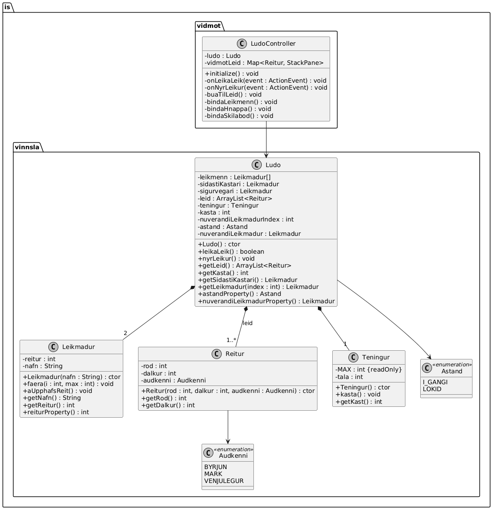

# Design Documentation

## Overview
The project follows a separation between user interface and business logic.

- `LudoController` belongs to the UI layer.
- `Ludo`, `Leikmadur`, `Reitur`, and `Teningur` belong to the business logic layer.

## UML Class Diagram

## Design Pattern
The project uses the Observer pattern in the interaction between the UI and the game model.

### Roles
- **Subject / Observable:** `Ludo`
- **Observer:** `LudoController`

The controller reacts to changes in the game state and updates the user interface accordingly.

## Responsibilities
- `Ludo`: manages game state and rules
- `Leikmadur`: represents a player
- `Reitur`: represents a board square
- `Teningur`: handles dice rolling
- `LudoController`: connects the UI to the game logic
